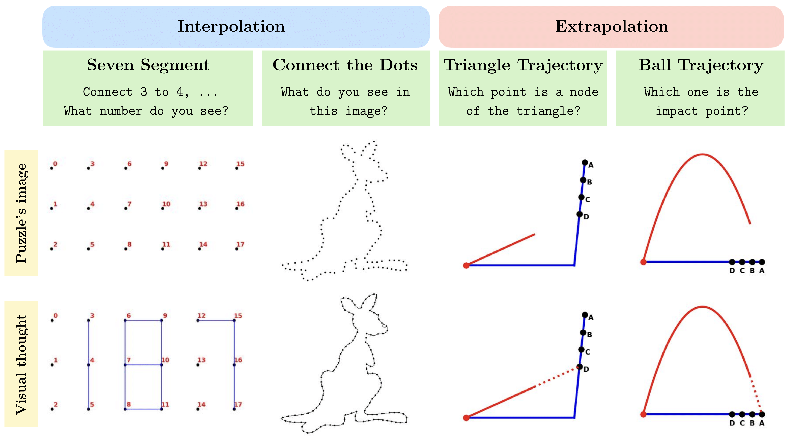
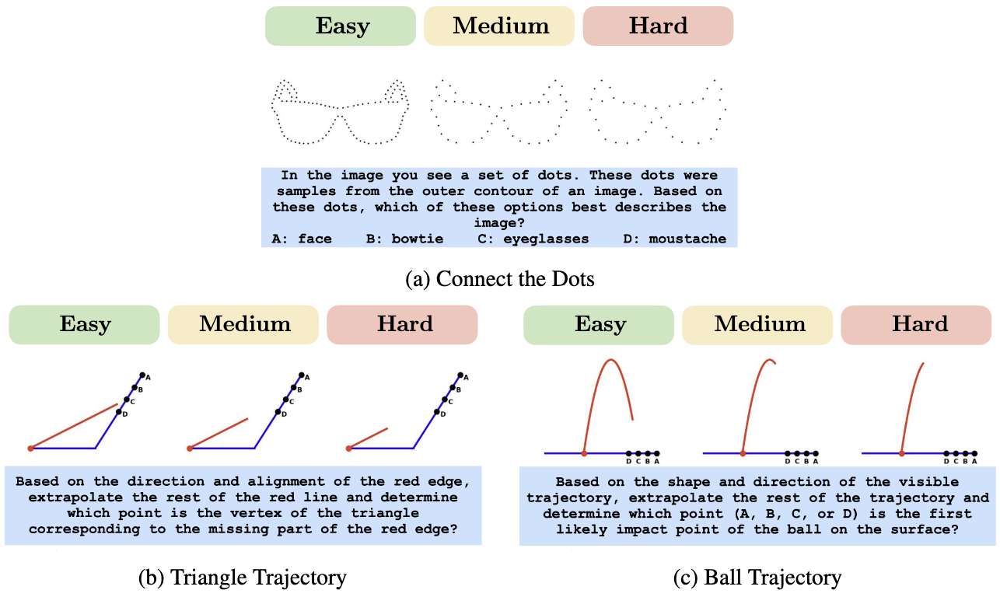

<p align="center">
  
</p>

<h1 align="center">A Benchmark for Evaluating the Mental Visualization Capabilities of Multimodal LLMs</h1>
<h3 align="center">Mohammad Shahab Sepehri, Berk Tinaz, Zalan Fabian, Mahdi Soltanolkotabi</h3>

<p align="center">
| 🤗 <a href="https://huggingface.co/datasets/shahab7899/Hyperphantasia">HuggingFace</a> | 
📄 <a href="https://openreview.net/pdf?id=NBU5IJGhCf">Paper</a> |
</p> 

<p align="center">
  <a href="LICENSE"></a>
</p>

<p align="justify" > 
Hyperphantasia is a synthetic Visual Question Answering (VQA) benchmark dataset that probes the mental visualization capabilities of Multimodal Large Language Models (MLLMs) from a vision perspective. We reveal that state-of-the-art models struggle with simple tasks that require visual simulation and imagination. Our dataset consists of 1200 samples with four different puzzles in two categories of Interpolation and Extrapolation.
</p>
<p align="center">
  
</p>
<p align="justify"> 
Hyperphantasia has three levels of difficulty to evaluate the extent and generalizability of mental visualization capabilities of MLLMs.
</p>

<p align="center">
  
</p>
<p align="justify"> 

## 📖 Table of Contents
  
  * [Dataset](#dataset)
  * [Requirements](#-requirements)
    * [Proprietary Models](#proprietary-models)
    * [Open-source Models](#open-source-models)
    * [Package Versions](#package-versions)
  * [Usage](#-usage)
    * [Evaluation](#evaluation)
    * [Arguments](#arguments)
  * [Acknowledgement](#acknowledgement)
  * [Citation](#-citation)

## Dataset
<p align="justify" > 
Hyperphantasia is publicly accessible in <a href="https://huggingface.co/datasets/shahab7899/Hyperphantasia">our HuggingFace</a>.
</p>

## 🔧 Requirements

Create and activate a `conda` environment with the following command:
```
conda create -n hyperphantasia python=3.10
conda activate hyperphantasia
```

Use the following code to install requirements:

```
pip install -r requirements.txt
```


If you have any problems using the models, please follow the instructions below.

### Proprietary Models
<p align="justify" > 
To use proprietary models, save your API keys in the root directory of the repo in a file named <code>.env</code>, including the keys as in the example below.
</p>

```
GEMINI_API_KEY=YOUR_KEY
OPENAI_API_KEY=YOUR_KEY
ANTHROPIC_API_KEY=YOUR_KEY
HUGGINGFACE_TOKEN=YOUR_KEY
```

The last one is your HuggingFace token in case you want to use a restricted open-source model in Huggingface.

### Open-source Models
If you encountered a CUDA memory error, set `device` to `auto`.
* `LLaMA 3.2`: You need access to its [Huggingface repository](https://huggingface.co/meta-llama/Llama-3.2-1B). After acquiring the access, add your HuggingFace.
* `DeepSeek-VL2`: Follow the installation from [here](https://github.com/deepseek-ai/DeepSeek-VL2).


### Package Versions
<p align="justify" > 
Different MLLMs need different versions of the <code>transformers</code> package. Please use the following versions for each MLLM.<br />
</p>

* `Molmo`: Use `transformers==4.48.2`
* `DeepSeek`: Use `transformers==4.38.2`
* `Other MLLMs`: Use `transformers==4.44.2` and `python>=3.8`

## 🔰 Usage

### Data Generation

<p align="justify" > 
To generate random puzzles, you can create new configurations similar to the ones in <a href="./configs/generation/">here</a> and run the following command.
</p>

```
python scripts/generate.py --config PATH_TO_CONFIG
```

### Evaluation

Before using the code, make sure to follow the instructions in [Requirements](#-requirements). <br />
<p align="justify" > 
You can add new or change existing model configurations in <code>configs/MODEL_NAME/</code>.
To use the evaluation code, use the following command:
</p>

```
python scripts/answering.py --model_name MODEL_NAME --difficulty DIFFICULTY
```

You can use the command below to evaluate models on your locally generated datasets.

```
python scripts/answering.py --model_name MODEL_NAME --dataset_path DATASET_PATH --local_dir
```

<p align="justify" > 
The code automatically downloads the data from HuggingFace, and the results will be saved in <code>Results/MODEL_NAME/</code>. You will see two files: one containing the final performance and one containing the answers provided by the model.  <br/>
</p>

### Arguments
* `model_name`: This is the name of your desired MLLM. Available options are `gpt` (OpenAI models), `gemini` (Gemini family), `claude` (Claude family), `qwen` (Qwen VL2.5 7B and 32B), `llama` (Llama 3.2 11B and 90B),`llava` (LLaVA-OneVision 7B and 72B), `molmo` (Molmo 7B and 72B), and `deepseek` (Deepseek-VL2).
* `model_args_path` (default: `configs/MLLM_NAME/SMALLER_MODEL.json`): Path to the model's configuration file.
* `resume_path` (default: `None`): If your run is interrupted and you want to resume evaluation, you should set this argument to the path to the answers of the previous run.
* `dataset_path`: Address to the evaluation dataset.
* `difficulty`: Difficulty level.
* `dataset_name` (default: the last sub-directory in `dataset_path`): Used in the name of result files.
* `device` (default: `cuda`): You can use `cuda`, `cpu`, or `auto` (for multi-GPU inference).

## Acknowledgement
We would like to thank Microsoft for an Accelerating Foundation Models Research grant that provided the OpenAI credits enabling this work. This research was also in part supported by AWS credits through an Amazon Faculty Research Award and a NAIRR Pilot Award. M. Soltanolkotabi and MS. Sepehri were supported by the USC–Capital One Center for Responsible AI and Decision Making in Finance (CREDIF) Fellowship. M. Soltanolkotabi is also supported by the Packard Fellowship in Science and Engineering, a Sloan Research Fellowship in Mathematics, an NSF-CAREER under award \#1846369, DARPA FastNICS program, and NSF-CIF awards \#1813877 and \#2008443. and NIH DP2LM014564-01. 


## 📌 Citation

If you use this code or our dataset, please cite our [paper](https://arxiv.org/abs/2507.11932v2).

```bibtex
@inproceedings{
  sepehri2025hyperphantasia,
  title={Hyperphantasia: A Benchmark for Evaluating the Mental Visualization Capabilities of Multimodal {LLM}s},
  author={Mohammad Shahab Sepehri and Berk Tinaz and Zalan Fabian and Mahdi Soltanolkotabi},
  booktitle={The Thirty-ninth Annual Conference on Neural Information Processing Systems Datasets and Benchmarks Track},
  year={2025},
  url={https://openreview.net/forum?id=NBU5IJGhCf}
}
```
